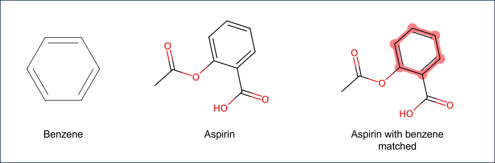
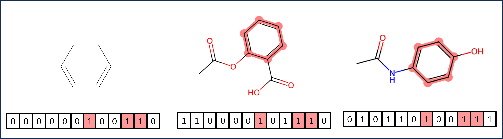

# Chem 274A - Final Assignment

This assignment has a Python component and a C++ component.
Each assignment combines concepts taught throughout the course.
This assignment is worth 20% of your final grade.

**Like the Problem Sets, your commits should show incremental development of your code.**

## C++ Final Project

For this project, you will write a fully-functioning matrix class in C++. This class will support
multiple ways of instantiating and manipulating matrices, as well as some of the 
more the common matrix operations.

We are giving you only a general specification and some individual function requirements,
leaving the implementation details up to you.  This is common in software development - we often have to make
decisions about an implementation where there is no single 'correct' answer, but
multiple ways of doing things. Understanding the benefits and drawbacks of various designs
is a large part of software engineering.

### Required features

1. The matrix class should be templated, so that it works with any
   type. Particularly, it should work with `double`, `float`,
   and `int`, along with the `std::complex` variations of those types.

2. The matrix should be constructable three different ways:
    1. With no arguments (`Matrix m;`)
    2. With a desired number of rows and columns (`Matrix m(3,2);`)
    3. Via copying an existing matrix

3. Accessing the elements of the matrix should be the parentheses operator. Ie, you should be able to
   access element 2,3 via `mat(2,3)`. The element should be modifiable via this method (`mat(2,3) = 10.0`).
   
4. The matrix should have the ability to be resized. When using this function,
   the user should assume that any existing data is either destroyed or
   invalid after resizing. 

5. The matrix class should support the following operations, either via member functions or operators:
   1. Matrix addition (overload the `+` operator) 
   2. Matrix multiplication (overload the `*` operator)
   3. Matrix element-wise multiplication
   4. Assignment of one matrix to another via the `=` operator
   5. Filling the matrix with a particular value
      1. via a `.fill()` member function
      2. via assignment of a scalar value (`m = 5;`)
   6. Comparison of two matrices (overload `operator==`. **HINT:** look up documentaton for `std::equal`)
   7. Printing of the matrix to a `std::ostream` object.
      1. Also, write a free function so that `std::cout << m;` works
   8. A function that returns the transpose of the matrix
   9. A function that returns the complex conjugate of the matrix
   10. A function that returns the conjugate transpose of the matrix
   11. Functions that perform the transpose, complex conjugate, and conjugate transpose in place (ie, they modify the matrix rather than return a new one)
   12. **For extra credit:** Computing the eigenvalues and eigenvectors of a matrix (**HINT:** - use blas/lapack internally)

The conjugate transpose is very common in quantum chemistry.
For details on what it is, see [Wikipedia](https://en.wikipedia.org/wiki/Conjugate_transpose).

**As a general hint, you should always be thinking about how you can re-use
existing functions to implement new features.** For example, a function that
returns a transpose and the function that transposes in place are very
related. Can one use the other?

Overall, the class should be `const` correct and free of memory leaks. You
should throw exceptions when operations aren't valid (ie, matrix multiplication
of incompatible sizes).

Since this is a templated class, it should exist completely in a header file.

Finally, create a `.cpp` source file to demonstrate your matrix class and
its capabilities.

Your project should have README documenting your class, and a Makefile that
compiles your example/test `.cpp` file.

## Python Final Project 

As discussed in Problem Set 3, graphs are the basis of many type of digital representations of molecules. 

In this project, you will use Python to create a graph representation of a molecule, creating a `Molecule` class.
The `Molecule` class that you create can be screened for particular functional groups (a "substructure search").

A substructure search lets medicinal chemists find molecules that contain a particular functional group.
In chemistry, a functional group is a group of atoms that have a particular chemical behavior.
If you are unfamiliar with chemical functional groups, you can find a list of common functional groups [here](https://en.wikipedia.org/wiki/Functional_group).

When a substructure search is performed, a molecule is analyzed to determine if it contains a chemical pattern of interest.
The figure below shows the beneze substructure matched in the aspirin molecule.



Substructure searches in molecules represented as graphs can be done by checking a molecular graph for a subgraph.
Another faster but less exact method is to use molecular fingerprints.

The concept of molecular fingerprints was covered in [Lab 7](https://classroom.github.com/a/-B1u0OMk).
Briefly, a molecular fingerprint is a vector of bits that represent the presence or absence of particular features in a molecule.
Although there are many different types of molecular fingerprints, graph representation of molecules form the foundation of most algorithms.
For this assignment, you will implement a molecular fingerprint based on graph traversal.

Consider the figure below. 
Based on molecular graph traversal, a benzene ring might result in the highlighted bits being set.
Any molecule that contains the same pattern will also have the same bits set.
Recall from Lab 7 that unlike a human fingerprint, molecular fingerprints are not necessarily unique to a molecule.
Note that because of this, the fingerprint of substructure search is less exact that subgraph searching because patterns other than benzene might result in the same bits being set.




### Required Features

For this final project, detailed specifications are not provided.
You will need to use what you have learned about classes in the Python programming language in order to complete the task.
**Consider how you can use concepts like inheritance, operator overloading, and special Python methods in your project.**

Create a `Molecule` class that can be used to represent a molecule.
For this project, you may use functions, methods, and classes that are part of the  [NetworkX](https://networkx.org/) library.
The functionality that you implement in this Project will be similar to the functionality that is provided by the [RDKit](https://www.rdkit.org/) library. If you were completing a project with molecules, it would be advisable to use this library instead of implementing your own functionality. However, for this Project, you *may not* use RDKit.

* The `Molecule` class should use a graph representation of the molecule. For this, consider how you may use composition or inheritance to create your class. 
Be able to explain the choice you made in your project documentation.
* Your `Molecule` class should be able to be constructed either from a list of atoms and bonds or from an SDF file.
* Your `Molecule` class should have a method or attribute that represents the molecular fingerprint of the molecule.
* Your `Molecule` class should be comparable to other `Molecule` objects through the equality operator (`==`). You may or may not choose to use a fingerprint for this task. You must explain your choice for the equality operator in your documentation.
* Your `Molecule` class should have a representation in Jupyter notebooks. 
Such that if a `Molecule` instance is the last thing in a Jupyter notebook cell, you see an image of the molecule. You can accomplish this by writing a `_ipython_display_` method for your class.
* A user should be able to import your `Molecule` object and use it in a Jupyter notebook or be able to perform a substructure screen **from the command line** (search for molecule within a set of molecules). For your command line interface you should consider using `sys.argv` or `argparse`. Explain your choice in  your project documentation.
* Your project should include testing of your code using pytest. You should have at least one test for each method in your `Molecule` class to ensure that your code runs. More extensive testing is encouraged.
* Your project should include a sample Jupyter notebook demonstrating your substructure search.
* Your project should include a Makefile that can be used to run your tests and build an environment.
* In your README, fully explain your code and repository. Be sure to include information on your design approach for your `Molecule` object. What principles from Chem 274A did you apply? You should discuss at least one other approach for creating the `Molecule` class that you did not use, and explain why you chose the approach that you did. 

For your fingerprint, you will have to choose parameters such as number of bits and path length.
As a reference, RDKit uses the following defaults for fingerprints:

* minimum path size: 1 bond
* maximum path size: 7 bonds
* fingerprint size: 2048 bits
* number of bits set per hash: 2

### Fingerprint Path Example

The following example is taken from [the Daylight website](http://www.daylight.com/dayhtml/doc/theory/theory.finger.html).

The molecule OC=CN would generate the following patterns:

0-bond paths:	  C	  O	  N  
1-bond paths:	  OC	  C=C	  CN  
2-bond paths:	  OC=C	  C=CN  
3-bond paths:	  OC=CN	  

The list of patterns produced is exhaustive: Every pattern in the molecule, up to the pathlength limit, is generated. For all practical purposes, the number of patterns one might encounter by this exhaustive search is infinite, but the number produced for any particular molecule can be easily handled by a computer.

Each pattern serves as a seed to a pseudo-random number generator (it is "hashed"), the output of which is a set of bits (typically 4 or 5 bits per pattern); the set of bits thus produced is added (with a logical OR) to the fingerprint. 

### Pseudocode for Molecular Fingerprint

Pseudocode, taken from ["Handbook of Chemoinformatics Algorithms"](https://ebookcentral-proquest-com.libproxy.berkeley.edu/lib/berkeley-ebooks/detail.action?pq-origsite=primo&docID=555698), for generating a molecular fingerprint is given below. 
Remember that you can utilized functionality in `NetworkX` to implement
the fingerprint. 

This pseudocode should provide you with a starting point, but your implementation or loop structure may differ depending on your choice in implementation.

```
method getHashedPathFingerprint(Molecule G, Size
d, Pathlength l)
{
    fingerprint = initializeBitvector(d)
    paths = getPaths(G,l)
    for all atoms in G do
        for all paths starting at atom do
            seed = hash(path) //generate an integer hash value
            randomIntSet=randomInt(seed) //generate a set of random integers
            for all rInts in randomIntSet do
                index = rInt % d //map the random int to a bit position
                fingerprint[index]=TRUE
            od
        od
od
return fingerprint
}
```

### Provided Files

The following files are provided for this assignment: 

* `provided.py` - contains improved `parse_sdf` function from Problem Set 3.
* `sdf.zip` - contains SDF files for molecules that you can use to test your code. 